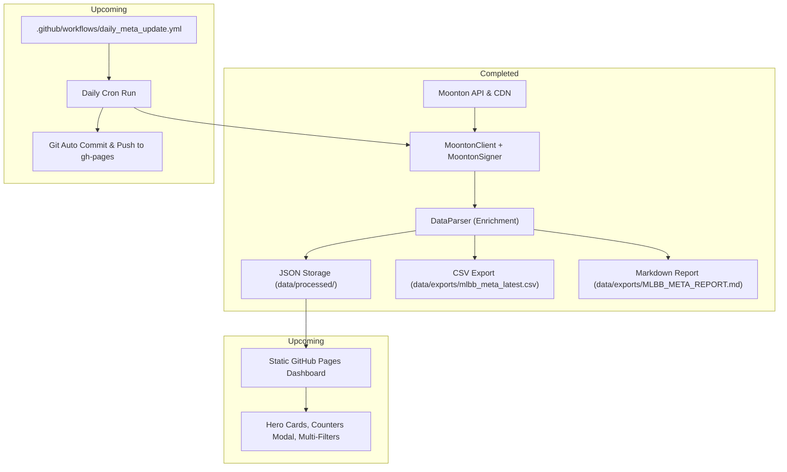

# MLBB Meta Analyser — Architecture & Roadmap

This document serves as the guide for continuing development across AI conversation sessions and development sprints.

---

## 1. System Pipeline

---

## 2. Phase 1 Accomplishments
- Implemented reverse-engineered Moonton HMAC-SHA1 signer.
- Extracted official hero catalog with skills, difficulty, roles, lanes, and HD portraits.
- Successfully queried and normalized all **30 rank slices** (5 timeframes $\times$ 6 rank brackets).
- Extracted both Counter and Synergy matrices.
- Exported flat CSV (3,990 rows) and Markdown meta report.

---

## 3. Phase 2: Web Interface Blueprint
The web interface will be hosted on GitHub Pages:
- **Location:** `web/` directory (or root for gh-pages).
- **Architecture:** Zero-backend static web app loading pre-rendered JSON from `data/processed/`.
- **Features to implement:**
  - Modern dark-themed dashboard (cleaner and faster than the official site).
  - Multi-select filters: Rank (All, Epic, Legend, Mythic, Honor, Glory+), Timeframe (1d, 3d, 7d, 15d, 30d), Role (Tank, Fighter, Assassin, Mage, Marksman, Support), Lane (Gold, EXP, Mid, Roam, Jungle).
  - Interactive Table: Sorting by Win Rate, Pick Rate, Ban Rate, Meta Score.
  - Hero Card Modal: Clicking a hero displays full skill details, cooldowns, lore, top 5 counters, and top 5 synergies.
  - "Last Updated" timestamp matching Moonton's official release schedule.

---

## 4. Phase 3: GitHub Actions Automation Blueprint
- Workflow file: `.github/workflows/daily_meta_update.yml`
- Trigger: Cron schedule `0 2 * * *` (Daily at 02:00 UTC) + `workflow_dispatch` (manual button).
- Job steps:
  1. Checkout repository.
  2. Setup Python 3.12.
  3. Install dependencies (`pip install -r requirements.txt`).
  4. Run `python -m scraper.run_scraper`.
  5. Commit and push updated JSON/CSV/Markdown files.
  6. Trigger GitHub Pages deployment.
